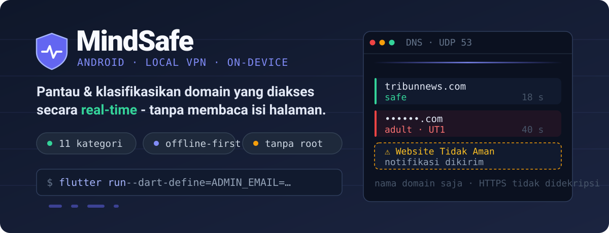
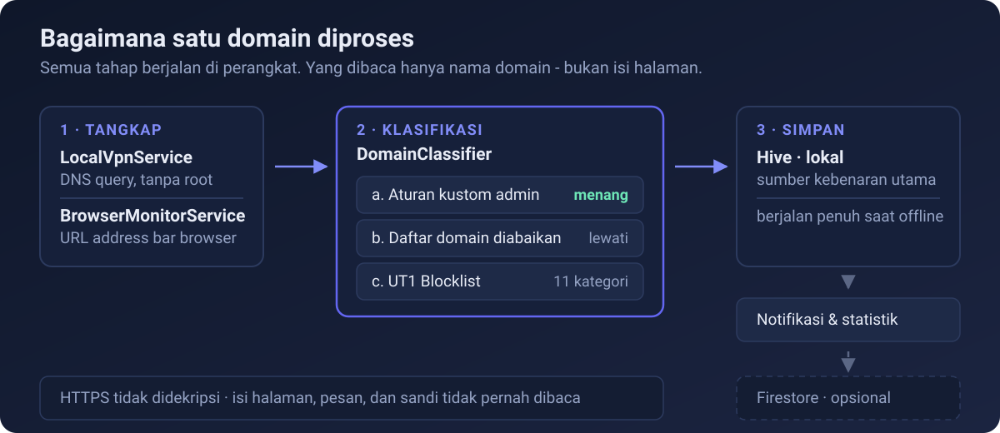

<p align="center">
  
</p>

<p align="center">
  <a href="LICENSE"></a>
  
  
  <a href="CONTRIBUTING.md"></a>
</p>

**MindSafe** mencatat domain yang diakses dari sebuah perangkat Android, mengklasifikasikannya ke dalam kategori (termasuk konten dewasa, judi, phishing, dan malware), lalu menyajikannya sebagai riwayat, statistik, dan notifikasi. Seluruh proses berjalan di perangkat: yang dibaca hanya **nama domain dan URL address bar**, bukan isi halaman - lalu lintas HTTPS tidak pernah didekripsi.

Aplikasi ini dibangun sebagai artefak **penelitian Tugas Akhir** di bidang keamanan internet dan kesadaran digital, dan kode sumbernya dibuka agar metodenya dapat ditelaah ulang.

---

## Daftar Isi

- [Cara Kerja](#cara-kerja)
- [Yang Bisa Dilakukan](#yang-bisa-dilakukan)
- [Instalasi](#instalasi)
- [Konfigurasi Firebase](#konfigurasi-firebase)
- [Aset Blocklist](#aset-blocklist)
- [Firestore Security Rules](#firestore-security-rules)
- [Batasan yang Diketahui](#batasan-yang-diketahui)
- [Privasi](#privasi)
- [FAQ](#faq)
- [Troubleshooting](#troubleshooting)
- [Kontribusi dan Dukungan](#kontribusi-dan-dukungan)
- [Lisensi dan Sitasi](#lisensi-dan-sitasi)

---

## Cara Kerja

<p align="center">
  
</p>

### 1 · Tangkap

`LocalVpnService.kt` membuka VPN lokal melalui Android `VpnService` API, membaca paket yang lewat, dan mengekstrak DNS query dari dalamnya - tanpa akses root dan tanpa merutekan lalu lintas ke server mana pun. Secara paralel, `BrowserMonitorService.kt` berjalan sebagai `AccessibilityService` dan membaca teks address bar browser sehingga URL halaman (bukan hanya domain) ikut tercatat. Chrome, Firefox, Edge, Opera, dan Brave termasuk yang didukung. Keduanya mengalirkan hasilnya ke sisi Flutter lewat `EventChannel`.

### 2 · Klasifikasi

`DomainClassifier` memutuskan kategori sebuah domain dalam tiga tahap berurutan:

| Tahap | Sumber                          | Perilaku                                 |
| ----- | ------------------------------- | ---------------------------------------- |
| a     | Aturan kustom admin (Firestore) | Menang atas semua tahap berikutnya       |
| b     | Daftar domain diabaikan         | Domain dan seluruh subdomainnya dilewati |
| c     | UT1 Blocklist                   | Mencocokkan ke 11 kategori               |

Kategori yang dikenali: `safe`, `adult`, `gambling`, `phishing`, `malware`, `cryptojacking`, `hacking`, `dating`, `warez`, `ddos`, dan `dangerous`.

### 3 · Simpan

Hasil klasifikasi ditulis ke **Hive** di perangkat, yang menjadi sumber kebenaran utama aplikasi - riwayat, kalender, chart, dan insight semuanya dibaca dari sana, sehingga aplikasi tetap berfungsi penuh tanpa koneksi internet. Dari titik ini, notifikasi lokal dipicu untuk domain berbahaya, statistik diperbarui, dan - bila pengguna masuk dengan akun - data disinkronkan ke Cloud Firestore untuk keperluan dashboard admin.

---

## Yang Bisa Dilakukan

### Pengguna

| Fitur              | Deskripsi                                                                       |
| ------------------ | ------------------------------------------------------------------------------- |
| **Monitoring VPN** | Menyalakan/mematikan pemantauan DNS query secara real-time lewat VPN lokal      |
| **URL Capture**    | Menangkap URL lengkap dari address bar browser via Accessibility Service        |
| **Dashboard**      | Statistik harian dan mingguan beserta tren aktivitas                            |
| **Riwayat**        | Riwayat per domain dengan chart harian/mingguan/bulanan dan kalender interaktif |
| **Insight**        | Ringkasan pola akses beserta saran kebiasaan digital yang lebih sehat           |
| **Notifikasi**     | Peringatan lokal ketika domain berkategori berbahaya terdeteksi                 |
| **Tema**           | Terang, gelap, atau mengikuti sistem                                            |
| **Dua bahasa**     | Bahasa Indonesia dan English                                                    |
| **Sinkronisasi**   | Sinkronisasi opsional ke Cloud Firestore setelah masuk dengan Google            |
| **Retensi data**   | Pilihan menyimpan data 7, 30, atau 90 hari                                      |
| **Onboarding**     | Panduan awal termasuk pemberian izin VPN dan Accessibility                      |

### Admin

Akun admin ditentukan dari satu alamat surel yang disuntikkan saat build (lihat [Konfigurasi Firebase](#konfigurasi-firebase)) dan diverifikasi ulang oleh Firestore Security Rules.

| Fitur                 | Deskripsi                                                                                                                                                                    |
| --------------------- | ---------------------------------------------------------------------------------------------------------------------------------------------------------------------------- |
| **Dashboard admin**   | Statistik agregat lintas pengguna: jumlah pengguna, total domain, jumlah aturan, jumlah domain diabaikan, rincian kategori, dan daftar domain terurut menurut durasi terlama |
| **Aturan domain**     | Menambah dan menghapus aturan klasifikasi kustom beserta kategorinya                                                                                                         |
| **Domain diabaikan**  | Mengelola domain yang dilewati saat monitoring, termasuk seluruh subdomainnya                                                                                                |
| **Notifikasi global** | Mengirim notifikasi ke semua pengguna (info, update, peringatan, tips)                                                                                                       |

---

## Instalasi

### Prasyarat

| Kebutuhan   | Versi / Catatan                                                                                                         |
| ----------- | ----------------------------------------------------------------------------------------------------------------------- |
| Flutter SDK | ≥ 3.11.0                                                                                                                |
| Dart SDK    | ≥ 3.11.0                                                                                                                |
| JDK         | 17                                                                                                                      |
| Android     | API 21+ (Android 5.0+)                                                                                                  |
| Perangkat   | **Perangkat fisik sangat disarankan** - `VpnService` dan `AccessibilityService` berperilaku tidak konsisten di emulator |
| Firebase    | Satu project Firebase milik Anda sendiri                                                                                |

### Langkah

```bash
# 1. Klon repositori
git clone https://github.com/alhifnywahid/mindsafe-app.git
cd mindsafe-app

# 2. Siapkan konfigurasi Firebase Anda sendiri
cp android/app/google-services.json.example android/app/google-services.json
# lalu ganti isinya dengan berkas hasil unduhan dari Firebase Console

# 3. Pasang dependensi
flutter pub get

# 4. Jalankan dengan surel admin disuntikkan saat build
flutter run --dart-define=ADMIN_EMAIL=surel.admin.anda@gmail.com
```

Sebelum menjalankan, unduh dan letakkan berkas blocklist sesuai bagian [Aset Blocklist](#aset-blocklist). Tanpa berkas tersebut aplikasi tetap berjalan, tetapi setiap domain akan diklasifikasikan sebagai `safe` kecuali cocok dengan aturan kustom admin.

---

## Konfigurasi Firebase

### 1. Buat project

1. Buka [Firebase Console](https://console.firebase.google.com) dan buat project baru.
2. Tambahkan aplikasi Android dengan package name **`com.gopret.mindsafe`**.
3. Unduh `google-services.json` dan letakkan di `android/app/google-services.json`.

Berkas `google-services.json` **tidak** ikut dilacak Git - hanya `google-services.json.example` yang ada di repositori. Jangan pernah meng-commit berkas hasil unduhan Anda.

### 2. Aktifkan layanan

- **Authentication** → aktifkan provider **Google Sign-In**.
- **Cloud Firestore** → buat database dalam mode production, lalu terapkan aturan pada bagian [Firestore Security Rules](#firestore-security-rules).

### 3. Tentukan akun admin

Surel admin tidak ditulis di dalam kode. Nilainya dibaca saat build melalui `String.fromEnvironment` di [`lib/core/config/app_config.dart`](lib/core/config/app_config.dart), lalu dipakai oleh `AuthService.isAdmin`:

```bash
# Mode debug
flutter run --dart-define=ADMIN_EMAIL=surel.admin.anda@gmail.com

# Rilis
flutter build apk --release --dart-define=ADMIN_EMAIL=surel.admin.anda@gmail.com
```

Bila `ADMIN_EMAIL` tidak diberikan, tidak ada akun yang dianggap admin dan panel admin tetap tertutup - build tetap berhasil. Surel yang sama **harus** dipakai di Firestore Security Rules, karena sisi klien hanya mengatur tampilan; otorisasi sebenarnya ditegakkan oleh Firestore.

---

## Aset Blocklist

Berkas blocklist berukuran total lebih dari 130 MB sehingga **tidak disertakan** di repositori dan diabaikan oleh `.gitignore`. Unduh secara terpisah, lalu letakkan semua berkas `.txt` di dalam `assets/blocklists/`.

📥 **[Unduh aset blocklist (Google Drive)](https://drive.google.com/drive/folders/1S767PcZlFrobctX16bQ7zK2IH0gySHKm?usp=sharing)**

Dataset bersumber dari **[UT1 Blocklist - Université Toulouse 1 Capitole](https://dsi.ut-capitole.fr/blacklists/)**, salah satu referensi klasifikasi domain yang banyak dipakai dalam penelitian keamanan internet.

```
assets/blocklists/
├── adult.txt          (~120 MB)
├── cryptojacking.txt
├── dangerius.txt      → dipetakan ke kategori "dangerous"
├── dating.txt
├── ddos.txt
├── gambling.txt
├── hacking.txt
├── malware.txt
├── phishing.txt
└── warez.txt
```

Format setiap berkas: satu nama domain per baris, tanpa skema dan tanpa `www.` (misalnya `contoh-domain.tld`). Nama berkas `dangerius.txt` mengikuti ejaan pada dataset aslinya dan dipetakan ke kategori `dangerous` di dalam `DomainClassifier`. Keterangan lengkap juga tersedia di [`assets/blocklists/README.md`](assets/blocklists/README.md).

---

## Firestore Security Rules

Ganti `admin@example.com` dengan surel admin yang sama seperti yang Anda berikan pada `--dart-define=ADMIN_EMAIL`. Berkas ini juga tersedia sebagai [`firestore.rules`](firestore.rules).

```javascript
rules_version = '2';
service cloud.firestore {
  match /databases/{database}/documents {

    function isAdmin() {
      return request.auth != null &&
        request.auth.token.email == 'admin@example.com';
    }

    match /users/{userId} {
      allow read: if request.auth != null &&
        (request.auth.uid == userId || isAdmin());
      allow write: if request.auth != null && request.auth.uid == userId;

      match /domain_accesses/{docId} {
        allow read: if request.auth != null &&
          (request.auth.uid == userId || isAdmin());
        allow write: if request.auth != null && request.auth.uid == userId;
      }
    }

    match /domain_rules/{ruleId} {
      allow read: if request.auth != null;
      allow write: if isAdmin();
    }

    match /skip_domains/{domainId} {
      allow read: if request.auth != null;
      allow write: if isAdmin();
    }

    match /app_config/{docId} {
      allow read: if request.auth != null;
      allow write: if isAdmin();
    }

    match /notifications/{docId} {
      allow read: if request.auth != null;
      allow write: if isAdmin();
    }
  }
}
```

---

## Batasan yang Diketahui

Batasan berikut bersifat arsitektural, bukan bug, dan penting dipahami sebelum menilai hasil pemantauan:

- **DNS over HTTPS (DoH) tidak terlihat.** Bila browser mengaktifkan Secure DNS, DNS query dikirim terenkripsi lewat HTTPS dan melewati VPN lokal sehingga tidak tertangkap. Ini penyebab paling umum domain tidak terdeteksi. Penangkapan URL via Accessibility Service tetap bekerja pada kasus ini untuk browser yang didukung.
- **Hanya nama domain dan URL.** Aplikasi tidak mendekripsi HTTPS, jadi jalur di dalam aplikasi non-browser (misalnya konten di dalam aplikasi media sosial) tidak dapat diklasifikasikan lebih rinci dari domainnya.
- **Cakupan kategori mengikuti UT1.** Sebuah domain yang belum terdaftar di dataset UT1 akan terklasifikasi `safe` kecuali admin menambahkan aturan kustom.
- **Android saja.** `VpnService` dan `AccessibilityService` adalah API khusus Android; tidak ada padanan iOS pada proyek ini.

---

## Privasi

- Yang dibaca hanya **nama domain** dan **URL address bar browser**.
- Lalu lintas HTTPS **tidak pernah didekripsi**. Isi halaman, pesan, dan sandi tidak pernah dibaca.
- VPN lokal **tidak** merutekan lalu lintas ke server eksternal mana pun dan karenanya tidak memperlambat koneksi.
- Sumber kebenaran data adalah penyimpanan **lokal (Hive)**. Sinkronisasi ke Firestore bersifat opsional dan hanya berjalan setelah pengguna masuk.
- Retensi data dapat diatur pengguna (7, 30, atau 90 hari) dan data dapat dihapus dari aplikasi.

MindSafe adalah alat pemantauan dan pencatatan. Aplikasi ini **bukan** alat diagnosis, terapi, maupun penilaian tingkat kecanduan.

---

## FAQ

**Bagaimana MindSafe memantau tanpa root?**
Android menyediakan `VpnService` yang mengizinkan aplikasi biasa menerima paket keluar perangkat setelah pengguna memberi izin. MindSafe memakai izin itu untuk membaca DNS query saja, lalu meneruskan paketnya seperti biasa. Tidak ada root, tidak ada server perantara.

**Apakah aplikasi membaca pesan atau isi halaman saya?**
Tidak. Yang dibaca hanya nama domain dan teks address bar browser. Lalu lintas HTTPS tidak didekripsi, sehingga isi halaman, pesan, sandi, dan berkas tidak dapat dibaca aplikasi ini.

**Apa bedanya dengan VPN biasa?**
VPN biasa merutekan seluruh lalu lintas ke server pihak ketiga. VPN lokal MindSafe berhenti di dalam perangkat: tidak ada lalu lintas yang dikirim keluar, tidak ada perlambatan, dan yang diperiksa hanya DNS request.

**Kenapa sebagian situs tidak terdeteksi?**
Hampir selalu karena **Secure DNS / DNS over HTTPS** aktif di browser. Matikan lewat:

- **Chrome** → Settings → Privacy and Security → Use Secure DNS → OFF
- **Firefox** → Settings → Enhanced DNS Privacy → Off
- **Edge** → Settings → Privacy and Security → Use Secure DNS → OFF

**Apakah aplikasi tetap jalan tanpa internet?**
Ya. Hive adalah sumber kebenaran utama; pemantauan, klasifikasi, riwayat, dan notifikasi berjalan penuh secara luring. Sinkronisasi Firestore menyusul saat koneksi tersedia.

**Bisakah saya memakai blocklist selain UT1?**
Secara teknis bisa, selama berkasnya mengikuti format satu domain per baris dan nama berkasnya cocok dengan pemetaan kategori di `DomainClassifier`. Dukungan resmi proyek ini terbatas pada UT1.

---

## Troubleshooting

| Masalah                                   | Solusi                                                                                                                                         |
| ----------------------------------------- | ---------------------------------------------------------------------------------------------------------------------------------------------- |
| **Domain tidak terdeteksi**               | Penyebab tersering: Secure DNS/DoH aktif di browser. Matikan (lihat FAQ). Pastikan juga notifikasi "VPN Active" tampil.                        |
| **Build gagal saat konfigurasi Firebase** | Pastikan `android/app/google-services.json` sudah ada dan package name-nya `com.gopret.mindsafe`. Jalankan `flutter clean && flutter pub get`. |
| **Panel admin tidak muncul**              | Build tanpa `--dart-define=ADMIN_EMAIL=...` membuat semua akun non-admin. Pastikan surelnya sama dengan yang ada di `firestore.rules`.         |
| **Izin VPN ditolak**                      | Android meminta persetujuan eksplisit setiap kali profil VPN dibuat. Nyalakan ulang monitoring dari dalam aplikasi dan setujui dialog sistem.  |
| **URL browser tidak tertangkap**          | Accessibility Service harus diaktifkan manual di Settings → Accessibility → MindSafe. Sebagian ROM mematikannya kembali setelah restart.       |
| **Blocklist tidak termuat**               | Pastikan berkas `.txt` sudah ada di `assets/blocklists/` dengan nama yang tepat (lihat [Aset Blocklist](#aset-blocklist)).                     |
| **Error adapter Hive**                   | Adapter (`lib/data/models/*.g.dart`) sudah ikut di repositori dan tidak perlu dibangkitkan. Jalankan `flutter clean && flutter pub get`.        |
| **Perilaku aneh di emulator**             | `VpnService` dan `AccessibilityService` tidak konsisten di emulator. Gunakan perangkat fisik.                                                  |

---

## Kontribusi dan Dukungan

| Kebutuhan                                                      | Tempatnya                                |
| -------------------------------------------------------------- | ---------------------------------------- |
| Panduan menyiapkan lingkungan, gaya kode, dan alur PR          | [CONTRIBUTING.md](CONTRIBUTING.md)       |
| Norma interaksi di ruang proyek ini                            | [CODE_OF_CONDUCT.md](CODE_OF_CONDUCT.md) |
| **Melaporkan kerentanan keamanan** (jangan lewat issue publik) | [SECURITY.md](SECURITY.md)               |
| Bertanya atau meminta bantuan                                  | [SUPPORT.md](SUPPORT.md)                 |
| Catatan perubahan antar versi                                  | [CHANGELOG.md](CHANGELOG.md)             |

Satu aturan yang tidak bisa dinegosiasikan: **jangan pernah meng-commit kredensial, surel sungguhan, riwayat penelusuran nyata, atau nama domain dewasa yang utuh.** Rinciannya ada di bagian _Aturan Khusus: Data Sensitif_ pada [CONTRIBUTING.md](CONTRIBUTING.md).

---

## Lisensi dan Sitasi

Kode sumber dilisensikan di bawah [MIT License](LICENSE).

Bila Anda merujuk proyek ini dalam karya akademik, gunakan metadata pada [CITATION.cff](CITATION.cff).

Dikembangkan oleh **Alhifny Wahid**, Universitas Dr. Soetomo, sebagai bagian dari penelitian Tugas Akhir.
